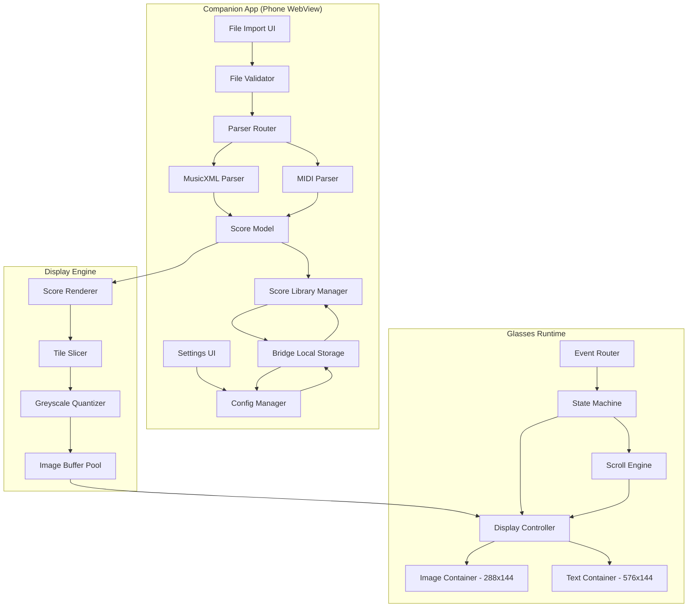

# Design Document: Sheet Music Reader

## Overview

Sheet Music Reader is an Even Realities G2 AR glasses application that renders imported sheet music as a virtual music stand visible in the glasses display. The app runs as a WebView application within the Even Hub ecosystem, using the G2's 576×288 pixel 4-bit greyscale display to show musical notation as pre-rendered image tiles. Musicians interact via the temple touchpad or R1 ring to trigger auto-scrolling, which advances notation at a tempo-synchronized rate with a configurable count-ahead countdown.

The core pipeline is: **Import → Parse → Render → Tile → Display → Scroll**. Files enter via the companion phone interface, are parsed into an internal Score model, rendered to an offscreen canvas, sliced into 288×144 greyscale tiles, and pushed to the glasses display. A state machine governs scroll behavior (idle/counting/scrolling/paused), driven by tap and swipe events from the touchpad or ring.

### Key Design Decisions

| Decision | Choice | Rationale |
|----------|--------|-----------|
| Rendering engine | VexFlow 5 (offscreen canvas) | Mature JS music engraving library; renders to Canvas API; no DOM dependency for actual output |
| MusicXML parser | `musicxml-interfaces` | Lightweight, typed MusicXML → JS object parser; no rendering dependencies |
| MIDI parser | `@tonejs/midi` | Well-maintained, TypeScript-friendly MIDI parser built on `midi-file` |
| Tile format | Raw 4-bit greyscale `Uint8Array` | SDK `updateImageRawData` accepts raw pixel arrays; 4-bit quantization done client-side |
| State management | Finite state machine (manual impl) | Simple enough to not need a library; 4 states with clear transitions |
| Storage | Bridge `setLocalStorage` / `getLocalStorage` | Only persistence API available in Even Hub WebView |

## Architecture



### Data Flow

1. **Import**: User selects file in companion UI → validator checks extension and size → parser converts to Score model → stored in library
2. **Load**: User picks score from library → Score deserialized from storage → renderer produces tile strip
3. **Display**: Tile at current viewport position sent to image container via `updateImageRawData`; measure number shown in text container
4. **Scroll**: State machine receives tap events → transitions through idle/counting/scrolling/paused → scroll engine advances viewport position at tempo-derived rate

## Components and Interfaces

### 1. File Validator (`src/import/validator.ts`)

Validates incoming files before parsing.

```typescript
interface ValidationResult {
  valid: boolean
  error?: string  // human-readable error for companion UI
}

function validateImportFile(file: { name: string; size: number }): ValidationResult
```

**Rules:**
- Accept extensions: `.musicxml`, `.mxl`, `.mid`
- Reject files > 10 MB
- Return descriptive error messages

### 2. Parser Router (`src/import/parser-router.ts`)

Routes validated files to the correct parser based on extension.

```typescript
function parseFile(fileName: string, data: ArrayBuffer): ParseResult<Score>

type ParseResult<T> = { success: true; value: T } | { success: false; error: string }
```

### 3. MusicXML Parser (`src/import/musicxml-parser.ts`)

Wraps `musicxml-interfaces` to extract Score data from MusicXML documents.

```typescript
function parseMusicXML(data: ArrayBuffer): ParseResult<Score>
```

Extracts: notes (pitch + duration), rests, measure boundaries, tempo markings, time signatures. Handles compressed `.mxl` (ZIP containing MusicXML).

### 4. MIDI Parser (`src/import/midi-parser.ts`)

Wraps `@tonejs/midi` to convert MIDI tracks into the Score model.

```typescript
function parseMidi(data: ArrayBuffer): ParseResult<Score>
```

Converts MIDI note-on/note-off pairs into pitched notes with durations. Infers measure boundaries from time signature meta-events.

### 5. Score Renderer (`src/render/renderer.ts`)

Renders Score data to a horizontal canvas strip using VexFlow.

```typescript
interface RenderOptions {
  staffHeight: number        // px per staff (default: 120 for single, 60 for dual)
  measuresPerTile: number   // measures per 288px tile (auto-calculated)
}

function renderScore(score: Score, options?: RenderOptions): RenderedScore

interface RenderedScore {
  tiles: Uint8Array[]        // 4-bit greyscale pixel arrays, each ≤ 288×144
  tileWidth: number          // actual px width of each tile (≤ 288)
  tileHeight: number         // actual px height of each tile (≤ 144)
  measuresPerTile: number    // how many measures fit per tile
  totalTiles: number
}
```

**Process:**
1. Create offscreen `<canvas>` sized to full score width × 144px height
2. Use VexFlow to draw staves, notes, rests, barlines
3. Extract pixel data via `getImageData()`
4. Slice into 288px-wide segments
5. Convert RGBA → 4-bit greyscale (luminance formula, then quantize to 0-15)

### 6. Greyscale Quantizer (`src/render/quantizer.ts`)

Converts RGBA canvas data to 4-bit greyscale suitable for the G2 display.

```typescript
function rgbaToGreyscale4bit(rgba: Uint8ClampedArray, width: number, height: number): Uint8Array
```

Formula: `grey = Math.round((0.299*R + 0.587*G + 0.114*B) * (A/255) * 15 / 255)`

Each byte in the output represents one pixel with value 0-15.

### 7. Tile Slicer (`src/render/tile-slicer.ts`)

Divides rendered score strip into tiles conforming to SDK size limits.

```typescript
function sliceIntoTiles(
  pixels: Uint8Array,
  fullWidth: number,
  fullHeight: number,
  maxTileWidth: number,   // 288
  maxTileHeight: number   // 144
): Uint8Array[]
```

### 8. Display Controller (`src/display/controller.ts`)

Manages the G2 display lifecycle and updates.

```typescript
interface DisplayController {
  init(bridge: EvenAppBridge): Promise<boolean>
  showTile(tileData: Uint8Array): Promise<void>
  updateStatus(text: string): Promise<void>
  showError(message: string): Promise<void>
  shutdown(): Promise<void>
}
```

**Layout:**
- Container 1 (image): position (0,0), 288×144, score tiles
- Container 2 (text): position (0,144), 576×144, status info, `isEventCapture: 1`

### 9. State Machine (`src/core/state-machine.ts`)

Governs the application's scroll state.

```typescript
enum ScrollState {
  IDLE = 'idle',           // waiting for tap to start
  COUNTING = 'counting',  // count-ahead countdown active
  SCROLLING = 'scrolling', // auto-advancing viewport
  PAUSED = 'paused'       // user paused auto-scroll
}

interface StateMachine {
  state: ScrollState
  transition(event: AppEvent): ScrollState
  onStateChange(callback: (from: ScrollState, to: ScrollState) => void): void
}

type AppEvent =
  | { type: 'TAP' }
  | { type: 'DOUBLE_TAP' }
  | { type: 'SWIPE_UP' }
  | { type: 'SWIPE_DOWN' }
  | { type: 'COUNT_COMPLETE' }
  | { type: 'FOREGROUND_EXIT' }
  | { type: 'FOREGROUND_ENTER' }
```

**Transition table:**

| Current State | Event | Next State |
|---------------|-------|------------|
| IDLE | TAP | COUNTING |
| COUNTING | COUNT_COMPLETE | SCROLLING |
| COUNTING | TAP | IDLE |
| SCROLLING | TAP | PAUSED |
| PAUSED | TAP | SCROLLING |
| SCROLLING | FOREGROUND_EXIT | PAUSED |
| PAUSED | FOREGROUND_ENTER | PAUSED (no change) |
| * | DOUBLE_TAP | → shutdown |

### 10. Scroll Engine (`src/core/scroll-engine.ts`)

Drives viewport advancement at the tempo-synchronized rate.

```typescript
interface ScrollEngine {
  start(score: Score, fromMeasure: number): void
  pause(): void
  resume(): void
  stop(): void
  setTempo(bpm: number): void
  getCurrentMeasure(): number
  onMeasureChange(callback: (measure: number) => void): void
}
```

**Timing:**
- Measure duration = `(beatsPerMeasure × 60) / bpm` seconds
- Scroll advances viewport by one tile per measure duration
- Uses `requestAnimationFrame` or `setInterval` with drift correction
- Accuracy target: ±100ms from expected beat position

### 11. Event Router (`src/core/event-router.ts`)

Translates raw bridge events into typed `AppEvent` objects, handling the SDK quirks.

```typescript
function createEventRouter(bridge: EvenAppBridge, stateMachine: StateMachine): () => void
```

**Responsibilities:**
- Coerces `undefined` eventType to 0 (CLICK_EVENT protobuf quirk)
- Implements 350ms tap-vs-double-tap discrimination
- Applies 300ms debounce to scroll gestures
- Routes events from both `textEvent` and `sysEvent` envelopes

### 12. Score Library Manager (`src/library/library-manager.ts`)

CRUD operations for the score library persisted in bridge local storage.

```typescript
interface LibraryEntry {
  id: string              // UUID
  title: string
  importedAt: number      // Unix timestamp ms
  scoreData: string       // JSON-serialized Score
}

interface LibraryManager {
  list(): Promise<LibraryEntry[]>
  save(score: Score, title: string): Promise<string>  // returns id
  load(id: string): Promise<Score>
  delete(id: string): Promise<void>
  getCount(): Promise<number>
}
```

Storage strategy: Library index stored as JSON array at key `"library_index"`. Each score stored individually at key `"score_{id}"`. Maximum 50 entries enforced at save time.

### 13. Config Manager (`src/config/config-manager.ts`)

Persists user preferences.

```typescript
interface AppConfig {
  countAhead: 4 | 8 | 12
  tempoOverride: number | null  // null = use file tempo
}

interface ConfigManager {
  load(): Promise<AppConfig>
  save(config: Partial<AppConfig>): Promise<void>
}
```

Storage key: `"app_config"`. Defaults: `{ countAhead: 4, tempoOverride: null }`.

## Data Models

### Score

```typescript
interface Score {
  title: string
  tempo: number              // BPM (20-400), default 120
  timeSignature: TimeSignature
  measures: Measure[]
  staves: number             // 1 for single, 2 for grand staff
}

interface TimeSignature {
  beats: number              // numerator (e.g., 4)
  beatValue: number          // denominator (e.g., 4)
}

interface Measure {
  number: number             // 1-based
  notes: NoteEvent[]
  tempoChange?: number       // BPM change at this measure (optional)
}

interface NoteEvent {
  type: 'note' | 'rest'
  pitch?: Pitch              // undefined for rests
  duration: Duration
  staff?: 1 | 2             // which staff (for grand staff scores)
}

interface Pitch {
  step: 'C' | 'D' | 'E' | 'F' | 'G' | 'A' | 'B'
  octave: number             // 0-9
  alter?: number             // -1 flat, 0 natural, 1 sharp
}

type Duration = 'whole' | 'half' | 'quarter' | 'eighth' | 'sixteenth' | 'thirty-second'
```

### Application State

```typescript
interface AppState {
  score: Score | null
  scrollState: ScrollState
  currentMeasure: number     // 0-based index into score.measures
  config: AppConfig
  countdownBeats: number     // remaining beats in count-ahead (0 when not counting)
}
```

### Library Storage Schema

```typescript
// Stored at key "library_index"
type LibraryIndex = Array<{
  id: string
  title: string
  importedAt: number
}>

// Stored at key "score_{id}"
type StoredScore = string  // JSON.stringify(Score)
```

## Correctness Properties

*A property is a characteristic or behavior that should hold true across all valid executions of a system — essentially, a formal statement about what the system should do. Properties serve as the bridge between human-readable specifications and machine-verifiable correctness guarantees.*

### Property 1: MusicXML Parsing Round-Trip

*For any* valid MusicXML document containing notes, rests, tempo markings, and time signatures, parsing the document into a Score and then serializing back to a comparable structure SHALL produce an equivalent representation preserving all note pitches, durations, rest positions, measure boundaries, tempo values (20-400 BPM), and time signatures.

**Validates: Requirements 1.1, 1.5, 1.7**

### Property 2: MIDI Parsing Round-Trip

*For any* valid MIDI file containing note-on/note-off events, tempo meta-events, and time signature meta-events, parsing the file into a Score SHALL produce a representation where every note's pitch and duration matches the source MIDI data, and measure boundaries align with the time signature divisions.

**Validates: Requirements 1.2, 1.5, 1.7**

### Property 3: Invalid File Extension Rejection

*For any* filename whose extension is not `.musicxml`, `.mxl`, or `.mid`, the file validator SHALL return an invalid result with a non-empty error message, and no Score data SHALL be modified.

**Validates: Requirements 1.3**

### Property 4: Malformed Data Rejection Preserves State

*For any* byte sequence that is not a valid MusicXML or MIDI file, and any existing library state, attempting to parse the data SHALL return a failure result and the library state SHALL remain identical to its state before the parse attempt.

**Validates: Requirements 1.4**

### Property 5: Rendered Tile Dimension Invariant

*For any* valid Score, every tile produced by the rendering pipeline SHALL have width ≤ 288 pixels, height ≤ 144 pixels, and every pixel value in the tile SHALL be an integer in the range [0, 15] (4-bit greyscale).

**Validates: Requirements 2.1, 2.2, 2.3**

### Property 6: Viewport Measure Display Consistency

*For any* Score with N measures and any viewport position P where 0 ≤ P < N, the text container SHALL display measure number (P + 1), matching the first measure visible in the current image tile.

**Validates: Requirements 2.4**

### Property 7: Auto-Scroll State Machine Toggle

*For any* tap event (regardless of source — glasses touchpad or R1 ring), when the current state is IDLE the system SHALL transition to COUNTING, when SCROLLING it SHALL transition to PAUSED, and when PAUSED it SHALL transition to SCROLLING.

**Validates: Requirements 3.1, 3.2, 3.3, 3.4**

### Property 8: Double-Tap Does Not Alter Scroll State

*For any* application state where two tap events arrive within 350 milliseconds of each other, the auto-scroll state SHALL remain unchanged (no IDLE→COUNTING, SCROLLING→PAUSED, or PAUSED→SCROLLING transition SHALL occur).

**Validates: Requirements 3.6**

### Property 9: Count-Ahead Duration Calculation

*For any* valid BPM value B in [20, 400] and count-ahead C in {4, 8, 12}, the count-ahead wait duration SHALL equal (C × 60 / B) seconds, and the displayed countdown SHALL decrement from C to 0 with each decrement occurring after exactly (60 / B) seconds.

**Validates: Requirements 4.2, 4.3**

### Property 10: Count-Ahead Persistence Round-Trip

*For any* valid count-ahead value V in {4, 8, 12}, persisting V to storage and then loading it back SHALL produce the same value V.

**Validates: Requirements 4.4**

### Property 11: Scroll Rate Matches Tempo and Time Signature

*For any* Score with tempo B BPM and time signature N/D, while auto-scroll is active the viewport SHALL advance by exactly one measure width per (N × 60 / B) seconds, with deviation from expected position not exceeding 100 milliseconds.

**Validates: Requirements 5.1, 5.4**

### Property 12: Tempo Override Validation

*For any* numeric value V, if 20 ≤ V ≤ 400 the tempo override SHALL be accepted and applied as the active tempo; if V < 20 or V > 400 the override SHALL be rejected and the current active tempo SHALL remain unchanged.

**Validates: Requirements 5.3, 5.5**

### Property 13: Manual Navigation Advances by One Measure

*For any* Score with N measures and viewport position P where 0 ≤ P < N, while auto-scroll is inactive: a swipe-down SHALL move position to min(P+1, N-1) and a swipe-up SHALL move position to max(P-1, 0).

**Validates: Requirements 6.1, 6.2, 6.4, 6.5**

### Property 14: Score Storage Round-Trip

*For any* valid Score object, storing it to the library and then loading it back by its assigned ID SHALL produce a Score object equal to the original, with matching title, tempo, time signature, and all measure/note data.

**Validates: Requirements 9.1**

### Property 15: Score Deletion Removes from Library

*For any* library containing scores S₁...Sₙ, deleting score Sᵢ SHALL result in the library containing exactly S₁...Sᵢ₋₁, Sᵢ₊₁...Sₙ, and attempting to load Sᵢ by ID SHALL fail.

**Validates: Requirements 9.4**

## Error Handling

### Import Errors

| Error Condition | User-Facing Message | Recovery |
|----------------|---------------------|----------|
| Unsupported extension | "Unsupported format: .{ext}. Please use .musicxml, .mxl, or .mid files." | User picks different file |
| File > 10 MB | "File exceeds 10 MB limit. Please use a smaller file." | User picks different file |
| Malformed MusicXML | "Could not parse file: {specific XML error}. The file may be corrupted." | User picks different file |
| Malformed MIDI | "Could not parse MIDI file: {specific error}." | User picks different file |
| Tempo out of range in file | Clamp to [20, 400] silently | Automatic |

### Display Errors

| Error Condition | Handling |
|----------------|----------|
| `createStartUpPageContainer` returns non-zero | Log error code; show "Display init failed (code {n})" on companion |
| `updateImageRawData` returns error | Show error reason in text container; retry on next scroll tick |
| Rendering produces empty output | Show "No notation to display" in text container |

### Storage Errors

| Error Condition | Handling |
|----------------|----------|
| `setLocalStorage` fails | Show "Could not save score" on companion; do not add to library index |
| `getLocalStorage` returns empty/corrupt | Show "Score data corrupted" on companion; offer deletion |
| Library full (50 scores) | Show "Library full (50 scores). Delete a score to import a new one." |

### Runtime Errors

- **Uncaught exceptions**: Wrapped in top-level try/catch; log to console; show generic error in text container
- **Bridge disconnection**: Event subscription failures logged; app continues in degraded mode (manual gestures may not work)
- **Memory pressure**: If tile rendering fails with memory error, reduce tile resolution and retry

## Testing Strategy

### Unit Tests (Vitest)

Focus on specific examples and edge cases:

- Parser tests: Known MusicXML and MIDI fixtures produce expected Score structures
- Validator edge cases: Boundary file sizes (exactly 10 MB, 10 MB + 1 byte), mixed-case extensions
- State machine: Verify each transition from the transition table with concrete event sequences
- Quantizer: Known RGBA values produce expected 4-bit grey values
- Config defaults: Missing storage key produces correct default config
- Lifecycle: Double-tap triggers shutdown sequence in correct order

### Property-Based Tests (fast-check)

Each correctness property above maps to a property-based test with minimum 100 iterations.

**Library:** `fast-check` (TypeScript property-based testing library)

**Configuration:**
- Minimum 100 iterations per property (`numRuns: 100`)
- Each test tagged with: `// Feature: sheet-music-reader, Property {N}: {title}`

**Test files:**
- `src/import/__tests__/parser.property.test.ts` — Properties 1-4
- `src/render/__tests__/renderer.property.test.ts` — Properties 5-6
- `src/core/__tests__/state-machine.property.test.ts` — Properties 7-8
- `src/core/__tests__/scroll-engine.property.test.ts` — Properties 9, 11
- `src/config/__tests__/config.property.test.ts` — Property 10
- `src/core/__tests__/tempo.property.test.ts` — Property 12
- `src/core/__tests__/navigation.property.test.ts` — Property 13
- `src/library/__tests__/library.property.test.ts` — Properties 14-15

**Generators:**
- `scoreArbitrary`: Generates random Score objects with 1-100 measures, random notes/rests, valid tempos, various time signatures
- `musicXmlArbitrary`: Generates valid MusicXML XML strings from random Score data
- `midiArbitrary`: Generates valid MIDI binary data from random Score data
- `invalidExtensionArbitrary`: Random filenames excluding `.musicxml`, `.mxl`, `.mid`
- `malformedDataArbitrary`: Random byte arrays unlikely to be valid music files
- `bpmArbitrary`: Random numbers (some valid 20-400, some invalid)
- `viewportPositionArbitrary`: Random position within a score's measure range

### Integration Tests

- Full import-to-display pipeline with fixture files
- Library CRUD operations against mock bridge storage
- Event routing end-to-end with simulated tap/swipe sequences
- Startup sequence timing (< 5 seconds)
- Score load from library timing (< 3 seconds)

### Manual Testing

- Visual verification of rendered notation quality on G2 hardware
- Tempo accuracy with metronome comparison
- Multi-staff layout readability
- Gesture responsiveness under real-world playing conditions
